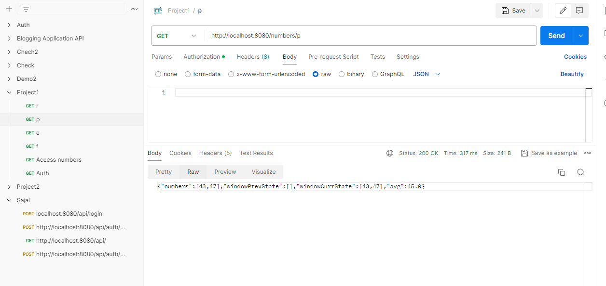
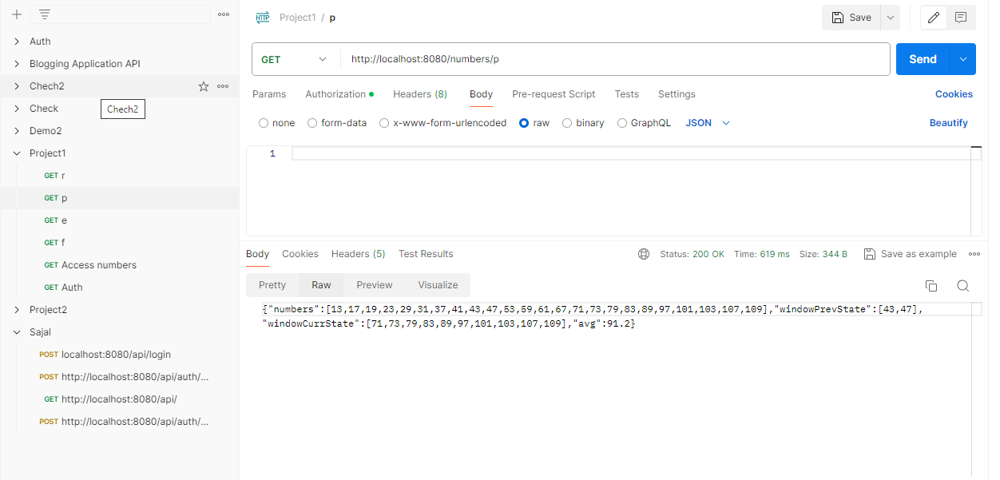
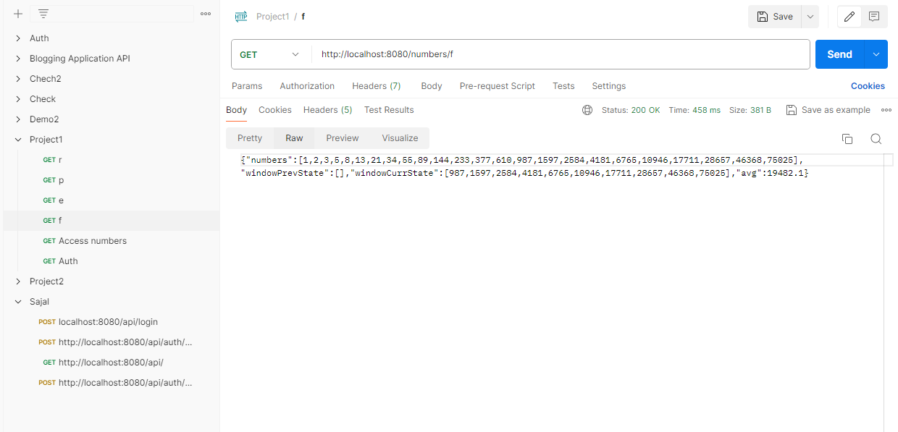
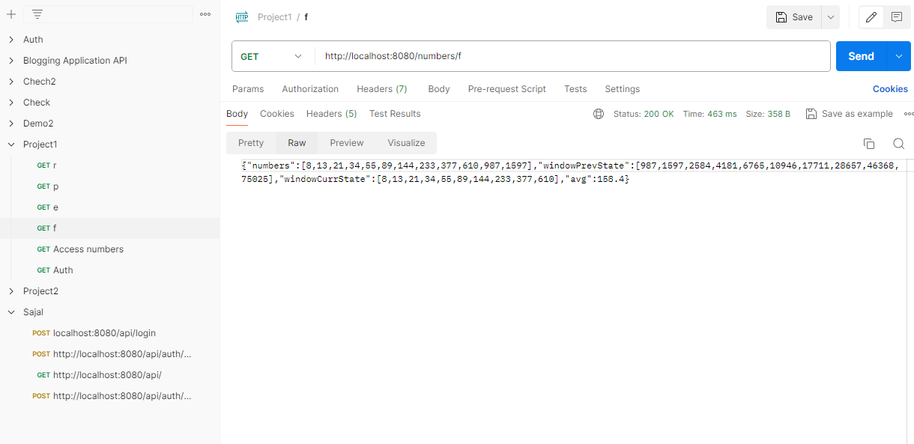
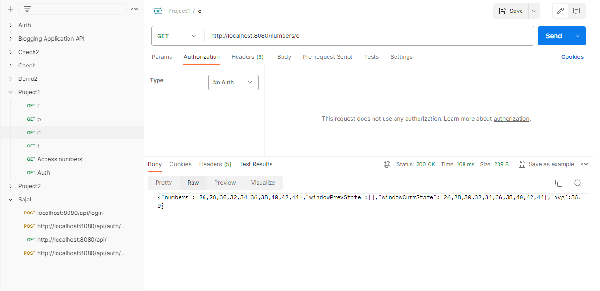
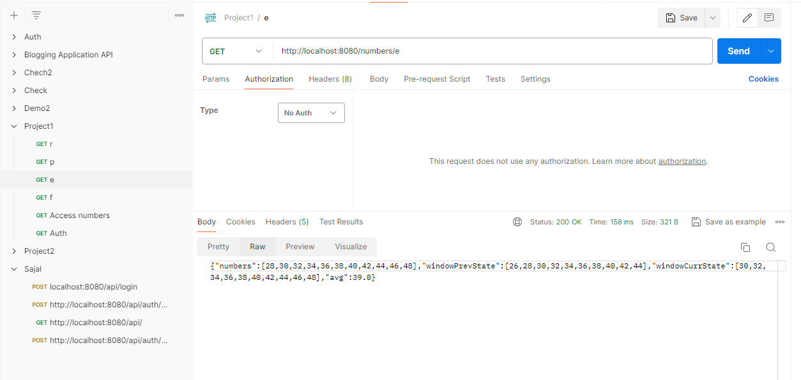
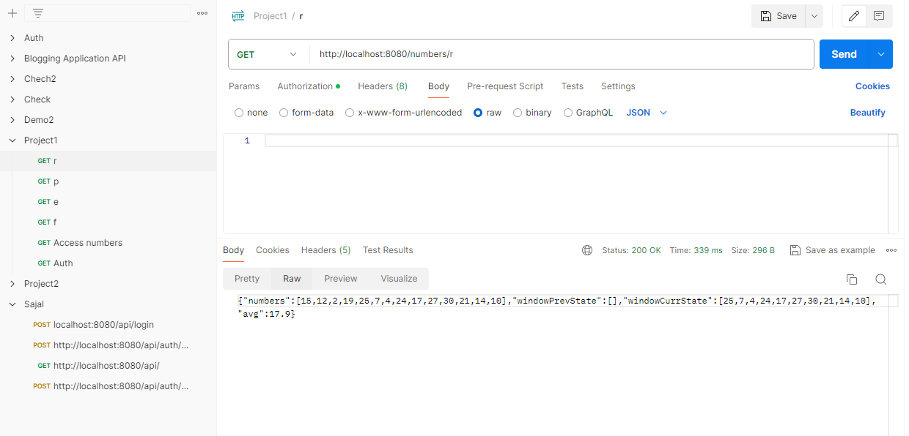
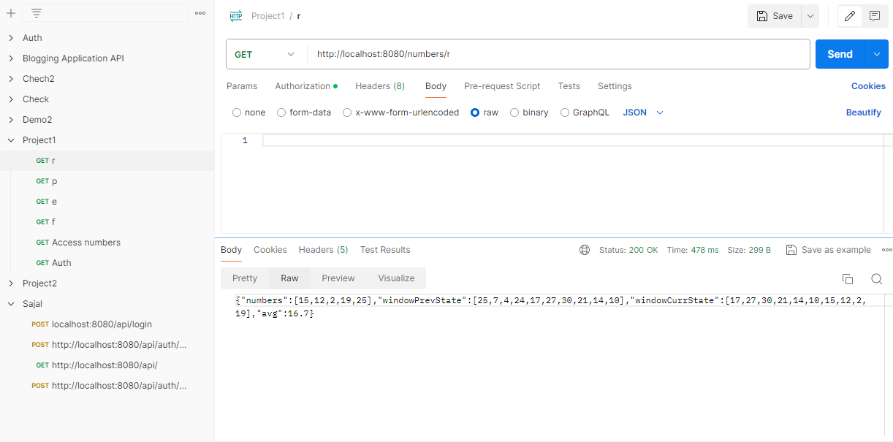

# Average Calculator Microservice Documentation

## Problem Statement

Develop an Average Calculator microservice that exposes a REST API `numbers/{numberId}`. The API should accept qualified number IDs ('p' for prime, 'f' for Fibonacci, 'e' for even, and 'r' for random numbers). The service should fetch numbers from a test server and store them with a window size of 10, ensuring uniqueness. The response should include the fetched numbers, previous and current window states, and the average of the current window.

## Postman Screenshots

### Test Case 1: Prime Numbers

**Request**: `GET http://localhost:8080/numbers/p`

**First Request**:

**Second Request**:

### Test Case 2: Fibonacci Numbers

**Request**: `GET http://localhost:8080/numbers/f`

**First Request**:

**Second Request**:

### Test Case 3: Even Numbers

**Request**: `GET http://localhost:8080/numbers/e`

**First Request**:

**Second Request**:

### Test Case 4: Random Numbers

**Request**: `GET http://localhost:8080/numbers/r`

**First Request**:

**Second Request**:

## Conclusion

The microservice successfully fetches numbers from the test server based on the provided qualifiers and calculates the average of the current window. It ensures uniqueness and maintains a sliding window with a size of 10, providing accurate responses for various test cases.
